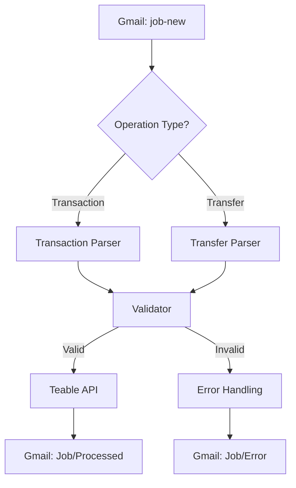

# Capital Focus

Capital Focus is a tool that automates the extraction of financial transactions from emails and stores them in Teable. It integrates with the Gmail API to monitor specific labels and uses specialized parsers to identify and extract data from bank notifications.

## Features

- **Automated Email Monitoring**: Scans Gmail for new transaction notifications.
- **Intelligent Classification**: Distinguishes between transactions and transfers based on email content.
- **Accurate Data Extraction**: Uses regex-based parsers to extract amounts, dates, commerce details, and reference numbers.
- **Data Validation**: Ensures all extracted information adheres to predefined JSON schemas.
- **Seamless Teable Integration**: Automatically uploads validated transaction data to a Teable table.
- **Email Lifecycle Management**: Moves processed emails to designated folders for organization and error tracking.

## Project Structure

- `src/app.py`: The entry point that orchestrates the entire workflow.
- `src/services/gmail.py`: Manages Gmail API authentication and email operations.
- `src/services/teable.py`: Handles interactions with the Teable REST API.
- `src/parsers/`: Contains logic to identify and extract data from various email formats.
- `src/schemas/`: Defines the structure for validated transaction and transfer data.
- `src/utils/`: Includes utility functions for text normalization, date formatting, and HTML processing.

## Prerequisites

### System Requirements
- Python 3.8 or higher
- A Google Cloud Project with the Gmail API enabled
- A Teable account and a target table

### Gmail API Setup
1. Create a project in the [Google Cloud Console](https://console.cloud.google.com/).
2. Enable the Gmail API for your project.
3. Create OAuth 2.0 credentials and download the `credentials.json` file.
4. Place `credentials.json` in the `src/secrets/` directory.

### Teable Setup
1. Create a table in Teable to store your transactions.
2. Obtain your personal access token and the ID of the table you wish to use.

## Installation

1. Clone the repository:
   ```bash
   git clone https://github.com/TheLastRKoch/capitalFocus.job.git
   cd capitalFocus.job
   ```

2. Create and activate a virtual environment:
   ```bash
   python -m venv venv
   source venv/bin/activate  # On Windows: venv\Scripts\activate
   ```

3. Install the required dependencies:
   ```bash
   pip install -r requirements.txt
   ```

## Configuration

Create a `.env` file in the root directory based on `env.example`:

```env
TEABLE_API_TOKEN=your_teable_token
TEABLE_TRANSACTIONS=your_table_id
```

## Usage

Start the application by running the following command:

```bash
python src/app.py
```

On the first run, a browser window will open to authorize the application to access your Gmail account. A `token.json` file will be created in `src/secrets/` to store the access credentials for future use.

## Workflow

The application follows a systematic process to handle financial notifications:

1. **Fetch**: Retrieves emails with the `label:job-new` label.
2. **Process**:
   - Normalizes text and identifies the operation type (Transaction or Transfer).
   - Extracts relevant fields using BeautifulSoup and regular expressions.
   - Validates the extracted data against the appropriate JSON schema.
3. **Store**: Sends the validated data to the configured Teable table.
4. **Organize**: Moves successfully processed emails to `Job/Processed` and emails with errors to `Job/Error`.


